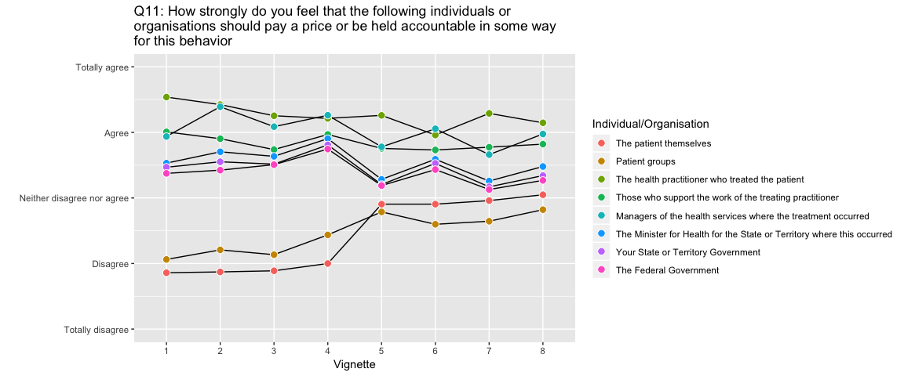
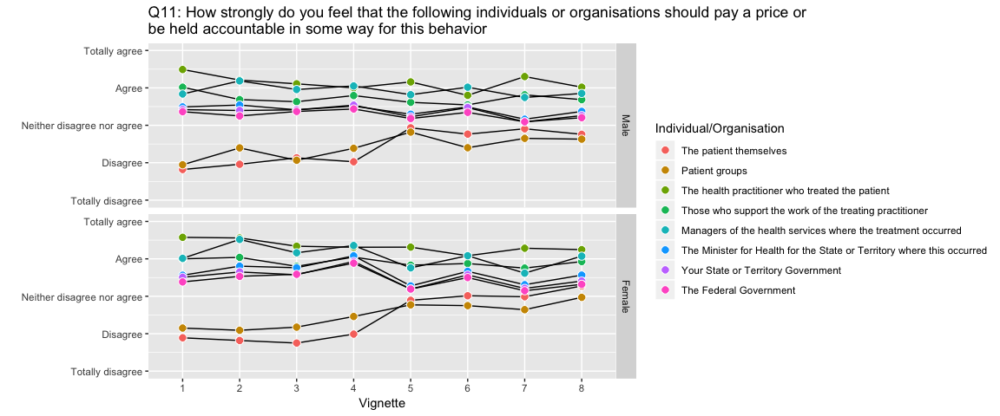
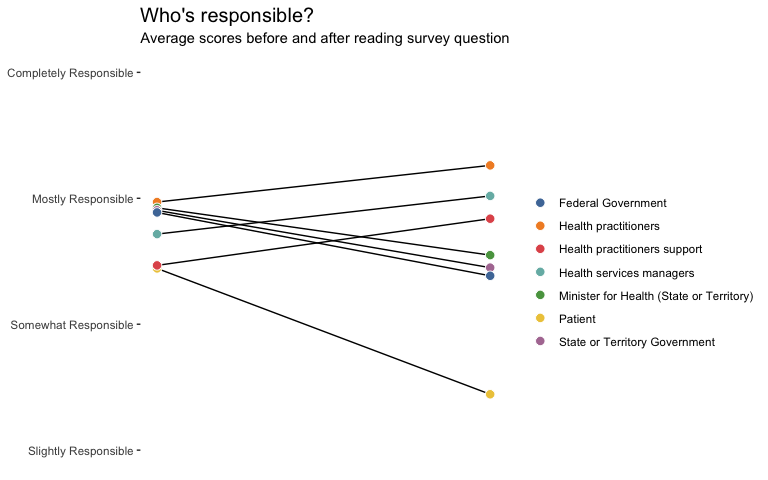
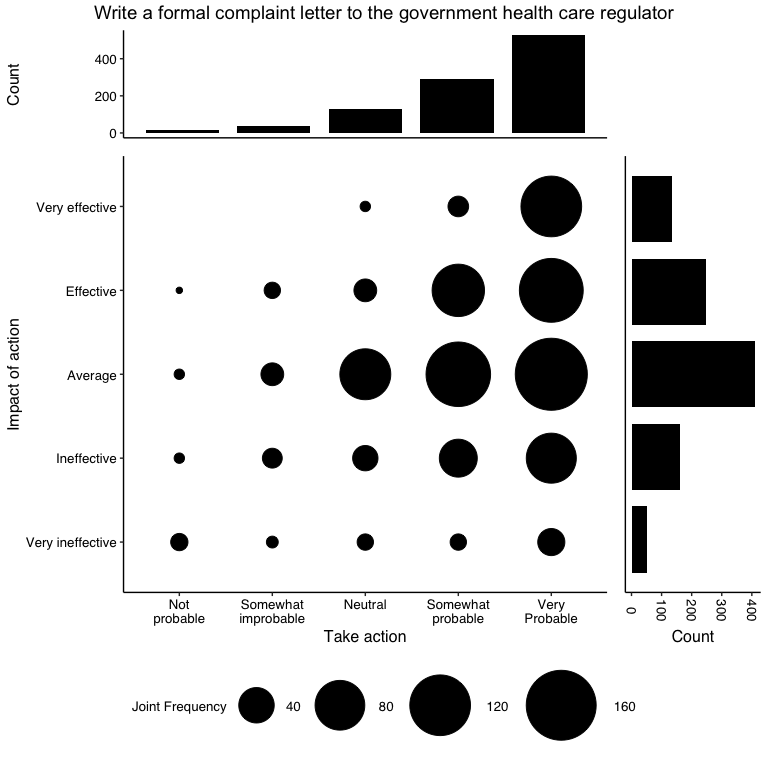

Health Survey Analysis
================
Adel Rahmani
23/03/2019

### Load a few libraries

``` r
library(MASS)
library(extrafont)
library(tidyverse)
library(readxl)
library(lubridate)
library(likert)
library(ggthemes)
library(viridis)
library(lemon)
library(gridExtra)
library(grid)
```

### Load the data

``` r
loadfonts()

data_file = 'Final Excel Health Regulation Survey_10_12_15.xlsx'

metadata_labels = read_xlsx(data_file, sheet = 'Labels')
metadata_values = read_xlsx(data_file, sheet = 'Values', skip = 1)

data = read_xlsx(data_file, sheet = 'Raw Data') %>% 
  filter(Gender !=3) %>% 
  mutate(Gender = factor(Gender, levels=c(1, 2), labels = c('Male', 'Female'))) %>% 
  mutate(Datesub = ymd(Datesub)) %>% 
  mutate(Vignette = factor(Message, levels=c(1, 2, 3, 4, 5, 6, 7, 8), ordered = TRUE)) %>% 
  select(-c(Status, Region, RID, Message, Datesub)) %>% 
  mutate(CLABSI = as.factor(ifelse(Vignette %in% 1:4, 1, 0))) %>% 
  mutate(ASTON  = as.factor(ifelse(Vignette %in% 5:8, 1, 0))) %>% 
  mutate(INDIV = as.factor(ifelse(Vignette %in% c(1, 3, 5, 7), 1, 0))) %>% 
  mutate(HOSP = as.factor(ifelse(Vignette %in% c(2, 4, 6, 8),1, 0))) %>% 
  mutate(RECK_INDIV = as.factor(ifelse(Vignette %in% c(1, 5), 1, 0))) %>% 
  mutate(RECK_HOSP  = as.factor(ifelse(Vignette %in% c(2, 6), 1, 0))) %>% 
  mutate(NEG_INDIV  = as.factor(ifelse(Vignette %in% c(3, 7), 1, 0))) %>% 
  mutate(NEG_HOSP   = as.factor(ifelse(Vignette %in% c(4, 8), 1, 0)))

tidy_data = data %>% 
  gather(key = Question, value = score, 
         -Vignette, 
         -Gender, 
         -Age,
         -CLABSI, 
         -ASTON,
         -INDIV,
         -HOSP,
         -RECK_INDIV,
         -RECK_HOSP,
         -NEG_INDIV,
         -NEG_HOSP)
```

#### Rename the labels and create a few helper functions to extract the metadata

``` r
labels = metadata_labels %>% 
  rename(variable.name = 'Variable Name') %>% 
  rename(variable.label = 'Variable label') 

label_text = metadata_values %>% 
  fill(Value, .direction = 'down') %>% 
  rename(variable=Value) %>% 
  mutate(X__1=as.integer(X__1)) %>% 
  rename(value=X__1) %>% 
  rename(label=Label)

age_lbl = c("Under 18 years",  
            "18-24 years",
            "25-34 years",
            "35-44 years",
            "45-54 years",
            "55-64 years",
            "65-74 years",
            "75 years and over")

get_label = function(Q){
  labels %>% 
    filter(variable.name == Q) %>% 
    select(variable.label) %>% 
    .[[1]]
}
```

#### Functions to extract information about the survey questions

``` r
#######################################################
# Get the text of the question (eg Q11)
get_question_main_label = function(Question, w=100){
  title = strsplit(get_label(paste0(Question, '_1')), ":")[[1]][[1]]
  title = strsplit(title, '_1.')[[1]][[2]]
  title = gsub('[‘’]', '', title)
  title = paste0(Question, ': ', title)
  title = paste(strwrap(title, width=w), collapse="\n")
  return(title)
}

#######################################################
# Get the text of the question (eg Q11)
get_question_main_label_single = function(Question, w=100){
  title = strsplit(get_label(Question), ":")[[1]]
  title = gsub('[‘’]', '', title)
  title = paste(strwrap(title, width=w), collapse="\n")
  return(title)
}

#######################################################
# Get the text of the options for the various responses
# (eg Q11_1)
get_question_label = function(Question){
  text = strsplit(get_label(Question), ":")[[1]][[2]]
  # text = strsplit(text, '_1.')[[1]][[2]]
  text = paste(strwrap(text, width=76), collapse="\n")
  return(text)
}

get_levels_for_question = function(Question){
  
  res = label_text %>% 
    subset(variable == Question) %>% 
    arrange(value) %>% 
    .[[3]]
  
  return(res)
}

get_text_for_question = function(Question){
  data %>% 
    select(contains(paste0(Question,'_'))) %>% 
    colnames %>% lapply(get_question_label)
}
```

#### Example

``` r
get_question_main_label('Q1')
```

    ## [1] "Q1: Rate the level responsibility you think should have for the quality and safety of the\nhealthcare provided in your State or Territory"

``` r
get_question_label('Q1_1')
```

    ## [1] "Individual patients"

``` r
get_levels_for_question('Q11_1')
```

    ## [1] "Totally disagree"           "Disagree"                  
    ## [3] "Neither disagree nor agree" "Agree"                     
    ## [5] "Totally agree"

``` r
get_text_for_question('Q11')
```

    ## [[1]]
    ## [1] "The patient themselves"
    ## 
    ## [[2]]
    ## [1] "Patient groups"
    ## 
    ## [[3]]
    ## [1] "The health practitioner who treated the patient"
    ## 
    ## [[4]]
    ## [1] "Those who support the work of the treating practitioner"
    ## 
    ## [[5]]
    ## [1] "Managers of the health services where the treatment occurred"
    ## 
    ## [[6]]
    ## [1] "The Minister for Health for the State or Territory where this occurred"
    ## 
    ## [[7]]
    ## [1] "Your State or Territory Government"
    ## 
    ## [[8]]
    ## [1] "The Federal Government"

#### Likert plots.

Since we're dealing with Likert scales let's create a nicer visualisation of the results than a bar chart.

``` r
plot_likert_bar = function(Question, vignette_group='ALL', w=100){
  
  firstQ = paste0(Question, '_1')
 
  title = get_question_main_label(Question, w)
  
    if (vignette_group %in% colnames(data)){
      tmp = data %>%
        filter(.[[vignette_group]] == 1)
      print(paste('Using subset', vignette_group, 
                  'with', count(tmp), 'elements.'))
      title = paste0(title,'\n(',vignette_group,')')
      
    } else if (vignette_group %in% 1:8) {
      
      tmp = data %>%
        filter(Vignette == vignette_group)
      print(paste('Using subset', vignette_group, 
                  'with', count(tmp), 'elements.'))
      title = paste0(title,'\n(Vignette ',vignette_group,')')
    } else {  
      tmp = data
    }
    
    tmp = tmp %>% 
      select(contains(paste0(Question,'_'))) %>% 
      mutate_all(funs(factor), levels=c(1,2,3,4,5), 
                 labels=get_levels_for_question(firstQ),
                 ordered=TRUE) 
    
    Q = as.data.frame(tmp)
    
    new.cols = get_text_for_question(Question)
  
    colnames(Q) = new.cols
    
    lQ = likert(Q)
  
    lQs = likert(summary = lQ$results)

    p = plot(lQs, low.color='red', ordered=TRUE) +
      ggtitle(title) +
      theme(plot.title = element_text(size = 14)) 
      # theme_update(legend.text = element_text(size = rel(0.7)))

    return(p)
}
```

##### Let's look at an example.

``` r
# OVERALL RESULT FOR Q11
p = plot_likert_bar('Q11', vignette_group = 'ALL') 
p
```


#### Look at survey question results vs vignette

``` r
plot_question_vs_vignette = function(Question){

  tidy_question_mean = data %>%
    group_by(Vignette) %>% 
    select(contains(Question)) %>% 
    summarize_all(mean) %>% 
    gather(key = Accountability, value = Mean, -Vignette) 
    
    labels = get_text_for_question(Question)
  
  tidy_question_mean %>% 
    ggplot(aes(x=Vignette, y=Mean, fill=Accountability,  group=Accountability)) +
    geom_line() +
    geom_point(size=3, shape=21, color="white") + 
    ylab('') +
    scale_fill_hue(labels=labels, name='Individual/Organisation') +
    scale_y_continuous(breaks = 1:5, 
                       labels = get_levels_for_question(paste0(Question,'_1')),
                       limits = c(1, 5)) +
    ggtitle(get_question_main_label(Question, w = 70))
 
}

p = plot_question_vs_vignette('Q11')
p 
```



#### Look at survey question results vs vignette *grouped by a factor*.

``` r
plot_question_vs_vignette_group1 = function(Question, Group){

  data %>% 
    mutate(Age = factor(Age, ordered = TRUE, levels = 1:8, labels = age_lbl)) %>% 
    group_by_('Vignette', Group) %>% 
    select(contains(paste0(Question,'_'))) %>% 
    summarise_all(mean) %>% 
    gather(key = Question, value=score, -Vignette, -Group) %>% 
    # gather(key = Question, value=score, -Gender,-Vignette, -Age) %>% 
    mutate(Question = as.factor(Question)) %>% 
    ggplot(aes(x=Vignette, y=score, fill=Question)) +
    geom_line(aes(group=Question)) +
    geom_point(shape=21, size=3, col='white') +
    facet_grid(reformulate(".", Group)) +
    scale_fill_hue(labels=get_text_for_question(Question), name='Individual/Organisation') +
    scale_y_continuous(breaks = 1:5, 
                       labels = get_levels_for_question(paste0(Question, '_1')),
                       limits = c(1, 5)) +
    ylab('') +
    ggtitle(get_question_main_label(Question)) 
}


# PLOT FOR Q11
p = plot_question_vs_vignette_group1('Q11', 'Gender')
p
```



#### Look at whether the respondents' opinion changes after filling out the survey

``` r
new_labels = c(
  'Patient',
  'Health practitioners',
  'Health practitioners support',
  'Health services managers',
  'Minister for Health (State or Territory)',
  'State or Territory Government',
  'Federal Government'
)

before = data %>% 
  select(starts_with('Q1_')) %>% 
  `colnames<-`(new_labels) %>% 
  summarise_all(mean) %>% 
  gather(key = Responsibility, value = score.before)

after = data %>% 
  select(starts_with('Q11_')) %>% 
  mutate(Q11_1 = (Q11_1 + Q11_2)/2) %>% 
  select(-Q11_2) %>% 
  `colnames<-`(new_labels) %>% 
  summarise_all(mean) %>% 
  gather(key = Responsibility, value = score.after)

opinions = before %>%  
  inner_join(after, by = 'Responsibility')%>% 
  gather(key = prior, value = score, -Responsibility) %>% 
  mutate(prior = ifelse(prior == 'score.before', 0, 1)) %>% 
  mutate(Responsibility = factor(Responsibility))

opinions %>% 
  ggplot(aes(fill=Responsibility)) +
  geom_path(aes(x=prior, y=score), col='black') +
  geom_point(aes(x=prior, y=score), size=3, shape=21, color="white") +
  geom_text(data = filter(opinions, prior==1), aes(x=prior, y=score,
                label=sprintf(" ", as.character(Responsibility)),
                vjust=0.5), hjust=0, size=3.5) +
  # scale_x_discrete(expand=c(0.3, 1), drop=T) +
  xlim(c(0, 1)) +
  scale_y_continuous(breaks = 1:5, 
                     labels = get_levels_for_question('Q1_1'),
                     limits = c(2, 5)) +
  scale_fill_tableau(name="") +
  theme_tufte(base_family="Arial") +
  labs(x=NULL, y=NULL, 
       title="Who's responsible?",
       subtitle = "Average scores before and after reading survey question") +
  # theme(axis.ticks=element_blank()) +
  # theme(axis.text=element_blank()) +
  # theme(legend.position="none") +
  theme(plot.title = element_text(size=15)) +
  theme(plot.title=element_text(hjust=0)) +
  theme(axis.title.x=element_blank(),
        axis.text.x=element_blank(),
        axis.ticks.x=element_blank()) 
```



#### Look at joint distribution of scores across two questions.

``` r
visualise_interaction = function(data, qA, qB, 
                                 label_Q = NULL,
                                 label_X = NULL,
                                 label_Y = NULL,
                                 fs=10) {

  # We want to pass unquoted variable names to the function
  # so we need to enquote them in the body of the function.
  QA = enquo(qA)
  QB = enquo(qB)
  
  if (is.null(label_Q)){
    label_Q = str_split(get_label(quo_name(QA)), " : ")[[1]][[2]]
  }
  
  # get_levels_for_question accepts a string hence the call to quo_name
  if (is.null(label_X)) {
    label_X = unname(sapply(get_levels_for_question(quo_name(QA)),
                            function(x) {paste(strwrap(x, width=10), collapse="\n")}))
  } 
  
  if (is.null(label_Y)) {
    label_Y = get_levels_for_question(quo_name(QB))
  }
  
  # dplyr functions use NSE so we need to "unwrap" the quosures with bang bang
  dfQA_QB = data %>%
    select(c(!!QA, !!QB))

  joint_count =  dfQA_QB %>%
    mutate(QQA = factor(!!QA, ordered=TRUE)) %>%
    mutate(QQB = factor(!!QB, ordered=TRUE)) %>%
    group_by(QQA,QQB) %>%
    count() %>%
    rename(Freq = n)

  # ggplot aes_ takes the variable name with quotes
  hist_top <- ggplot(data) + 
    geom_bar(aes_(QA), stat = "count", width=0.8, fill='black') + 
    ylab('Count') +
    xlab(NULL) + theme_classic() +
    theme(axis.title.x=element_blank(),
          axis.title.y=element_text(size=fs+2, 
                                    family='Helvetica', color="black"),
          axis.text.x=element_blank(),
          axis.ticks.x=element_blank(),
          axis.text.y = element_text(angle = 0, hjust = 1, size=fs, 
                                     family='Helvetica', color="black"))
          
  empty <- ggplot()+geom_point(aes(1, 1), colour="white")+
    theme(axis.ticks=element_blank(),
          panel.background=element_blank(),
          axis.text.x=element_blank(), axis.text.y=element_blank(),
          axis.title.x=element_blank(), axis.title.y=element_blank())

  scatter = ggplot(joint_count, aes(QQA, QQB, size=Freq)) + 
    geom_count(aes(group = 1)) +
  # geom_point(aes(QQA, QQB, size=Freq), shape=20) +
    # scale_fill_continuous(low = min(joint_count$Freq), high = max(joint_count$Freq), name="Joint frequency") +
    # scale_size(range = c(1, 20)) +
    scale_size_area(max_size = 25, name="Joint Frequency") +
    scale_x_discrete(breaks=1:5,
                     labels=label_X) +
    scale_y_discrete(breaks=1:5,
                     labels=label_Y) +
    # xlab(label_Q13) +
    labs(size = "Count") +
    xlab('Take action') +
    ylab('Impact of action') +
    # ggtitle('Write a formal letter to regulator') +
    theme_classic() +
    theme(axis.text.x = element_text(angle = 0, size=fs, family='Helvetica', color="black"),
          axis.text.y = element_text(angle = 0, size=fs, family='Helvetica', color="black"),
          axis.title=element_text(size=fs+2, family='Helvetica'),
          legend.text = element_text(size=fs, family='Helvetica', color="black"),
          legend.title = element_text(size=fs, family='Helvetica', color="black"))


  hist_right <- ggplot(data)+geom_bar(aes_(QB), stat="count", width=0.8, fill='black')+
    coord_flip()+ylab('Count')+xlab(NULL)+
    theme_classic() +
    theme(axis.title.y=element_blank(),
          axis.title.x=element_text(size=fs+2, 
                                    family='Helvetica', color="black"),
          axis.text.y=element_blank(),
          axis.ticks.y=element_blank(),
          axis.text.x = element_text(angle = -90, vjust=0.5, size=fs, 
                                     family='Helvetica', color="black"))

  legend <- g_legend(scatter + theme(legend.position='bottom'))

  t_hist_top   = ggplot_gtable(ggplot_build(hist_top))
  t_empty      = ggplot_gtable(ggplot_build(empty))
  t_scatter    = ggplot_gtable(ggplot_build(scatter+theme(legend.position='hidden')))
  t_hist_right = ggplot_gtable(ggplot_build(hist_right))


  t_hist_right$heights = t_scatter$heights
  t_hist_top$widths = t_scatter$widths

  g = grid.arrange(t_hist_top,
                   t_empty,
                   t_scatter,
                   t_hist_right,
                   ncol=2,
                   nrow=2,
                   widths=c(4, 1),
                   top=textGrob(label_Q,
                                gp=gpar(fontsize=fs+4,font=1, family='Helvetica')),
                   bottom=legend$grobs[[1]],
                   heights=c(1, 4))

  return(g)
}

g1 = visualise_interaction(data, Q13_1, Q14_1)
```



Regression
----------

### Prepare the data

``` r
# Could have simply used FORMAL_QA = c('Q13_1', 'Q13_2', 'Q13_4', 'Q13_5')
# and avoided the triple bang (!!!) in the dplyr statement below but I wanted
# to experiment with quosures...

FORMAL_QA = quos(Q13_1, Q13_2, Q13_4, Q13_5)
FORMAL_QB = quos(Q14_1, Q14_2, Q14_4, Q14_5)

SOCIAL_QA = quos(Q13_3, Q13_6, Q13_7, Q13_8, Q13_9)
SOCIAL_QB = quos(Q14_3, Q14_6, Q14_7, Q14_8, Q14_9)

tmp_formal_num = data %>% 
  select(!!!c(FORMAL_QA, FORMAL_QB)) %>% 
  rowwise() %>% 
  mutate(mean_QA = sum(!!!FORMAL_QA, na.rm = T)/length(FORMAL_QA)) %>% 
  mutate(mean_QB = sum(!!!FORMAL_QB, na.rm = T)/length(FORMAL_QB)) %>% 
  select(mean_QA, mean_QB) 

tmp_formal = tmp_formal_num %>%
  mutate(mean_QA = cut(mean_QA, include.lowest = TRUE, ordered_result = TRUE,
                       breaks=c(0, 1.5, 2.5, 3.5, 4.5, 5), 
                       # labels=c("<1.5","[1.5, 2.5)","[2.5, 3.5)","[3.5, 4.5)", ">4.5"))) %>% 
                       labels=1:5)) %>% # use simple integer label to match xaxis breaks later
  mutate(mean_QB = cut(mean_QB, include.lowest = TRUE, ordered_result = TRUE,
                       breaks=c(0, 1.5, 2.5, 3.5, 4.5, 5), 
                       # labels=c("<1.5","[1.5, 2.5)","[2.5, 3.5)","[3.5, 4.5)", ">4.5"))) 
                       labels=1:5)) 
  
tmp_formal
```

    ## Source: local data frame [1,006 x 2]
    ## Groups: <by row>
    ## 
    ## # A tibble: 1,006 x 2
    ##    mean_QA mean_QB
    ##    <ord>   <ord>  
    ##  1 4       4      
    ##  2 4       3      
    ##  3 4       3      
    ##  4 4       2      
    ##  5 4       3      
    ##  6 4       3      
    ##  7 5       5      
    ##  8 5       4      
    ##  9 4       4      
    ## 10 4       3      
    ## # ... with 996 more rows

``` r
tmp_social_num = data %>% 
  select(!!!c(SOCIAL_QA, SOCIAL_QB)) %>% 
  rowwise() %>% 
  mutate(mean_QA = sum(!!!SOCIAL_QA, na.rm = T)/length(SOCIAL_QA)) %>% 
  mutate(mean_QB = sum(!!!SOCIAL_QB, na.rm = T)/length(SOCIAL_QB)) %>% 
  select(mean_QA, mean_QB) 

tmp_social = tmp_social_num %>% 
  mutate(mean_QA = cut(mean_QA, include.lowest = TRUE, ordered_result = TRUE,
                       breaks=c(0, 1.5, 2.5, 3.5, 4.5, 5), 
                       labels=1:5)) %>% 
  mutate(mean_QB = cut(mean_QB, include.lowest = TRUE, ordered_result = TRUE,
                       breaks=c(0, 1.5, 2.5, 3.5, 4.5, 5), 
                       labels=1:5)) 


data2 = data %>% mutate(Age = factor(Age), 
                        D1 = factor(D1),
                        WorkedInHealthcare = relevel(factor(D2), ref='2'),
                        D3 = factor(D3)) %>% 
                  mutate(WorkedInHealthcare = fct_recode(WorkedInHealthcare, 'Yes' = '1', 'No' = '2')) %>% 
                  mutate(Gender = relevel(Gender, ref='Female')) %>% 
                  mutate(degree = ifelse(D1 %in% c('4','5','6'), 1, 0)) %>% 
                  mutate(Age = relevel(fct_collapse(Age, 
                                            '18 to 44' = c('2', '3', '4'),
                                            '45 to 64' = c('5', '6'),
                                            '65 and over' = c('7','8') ), ref='18 to 44')) %>% 
                  mutate(Age = factor(Age, ordered = T)) %>% 
                  mutate(GPvisits = relevel(fct_collapse(D3, 
                                                   'None or once' = c('1', '2'),
                                                   '2-3 times' = '3',
                                                   'More than 3 times' = '4'), ref='More than 3 times')) %>% 
                  mutate(reck = factor(ifelse((RECK_INDIV == 1) | (RECK_HOSP == 1), 1, 0))) %>% 
                  mutate(reck = fct_recode(reck, 'Yes'='1', 'No'='0')) %>% 
                  mutate(CLABSI = fct_recode(CLABSI, 'Yes'='1', 'No'='0')) %>% 
                  mutate(formal_action = tmp_formal_num$mean_QA) %>% 
                  mutate(formal_impact = tmp_formal_num$mean_QB) %>% 
                  mutate(social_action = tmp_social_num$mean_QA) %>% 
                  mutate(social_impact = tmp_social_num$mean_QB) %>% 
                  mutate(formal_action_fac = tmp_formal$mean_QA) %>% 
                  mutate(formal_impact_fac = tmp_formal$mean_QB) %>% 
                  mutate(social_action_fac = tmp_social$mean_QA) %>% 
                  mutate(social_impact_fac = tmp_social$mean_QB) %>% 
                  mutate(c_patient = Q11_1 - mean(Q11_1)) %>% 
                  mutate(c_doc = Q11_3 - mean(Q11_3)) %>% 
                  mutate(c_helper = Q11_4 - mean(Q11_4)) %>% 
                  mutate(c_manager = Q11_5 - mean(Q11_5)) %>% 
                  mutate(c_minister = Q11_6 - mean(Q11_6)) %>% 
                  mutate(c_formal_action = formal_action - mean(formal_action)) %>% 
                  mutate(c_formal_impact = formal_impact - mean(formal_impact)) %>% 
                  mutate(c_social_action = social_action - mean(social_action)) %>% 
                  mutate(c_social_impact = social_impact - mean(social_impact))
```

#### Ordinal logistic regression

``` r
pom = polr(data=data2, formula = 'formal_impact_fac ~ c_formal_action + c_social_action + Gender + CLABSI + c_patient + c_doc + degree')
summary(pom)
```

    ## Call:
    ## polr(formula = "formal_impact_fac ~ c_formal_action + c_social_action + Gender + CLABSI + c_patient + c_doc + degree", 
    ##     data = data2)
    ## 
    ## Coefficients:
    ##                   Value Std. Error t value
    ## c_formal_action  1.2088    0.10862  11.128
    ## c_social_action  0.1869    0.08383   2.230
    ## GenderMale      -0.1880    0.12661  -1.485
    ## CLABSIYes        0.3294    0.13246   2.487
    ## c_patient        0.1393    0.05279   2.639
    ## c_doc            0.1129    0.09234   1.223
    ## degree          -0.2364    0.12827  -1.843
    ## 
    ## Intercepts:
    ##     Value    Std. Error t value 
    ## 1|2  -4.8115   0.2818   -17.0762
    ## 2|3  -2.3660   0.1452   -16.2980
    ## 3|4   0.4955   0.1172     4.2285
    ## 4|5   2.6839   0.1499    17.9103
    ## 
    ## Residual Deviance: 2224.879 
    ## AIC: 2246.879

``` r
odds= exp(-coef(pom))

(ctable <- round(coef(summary(pom)), 3))
```

    ##                  Value Std. Error t value
    ## c_formal_action  1.209      0.109  11.128
    ## c_social_action  0.187      0.084   2.230
    ## GenderMale      -0.188      0.127  -1.485
    ## CLABSIYes        0.329      0.132   2.487
    ## c_patient        0.139      0.053   2.639
    ## c_doc            0.113      0.092   1.223
    ## degree          -0.236      0.128  -1.843
    ## 1|2             -4.811      0.282 -17.076
    ## 2|3             -2.366      0.145 -16.298
    ## 3|4              0.496      0.117   4.228
    ## 4|5              2.684      0.150  17.910

``` r
p <- pnorm(abs(ctable[, "t value"]), lower.tail = FALSE) * 2
(ctable <- cbind(ctable, "p value" = round(p, 3)))
```

    ##                  Value Std. Error t value p value
    ## c_formal_action  1.209      0.109  11.128   0.000
    ## c_social_action  0.187      0.084   2.230   0.026
    ## GenderMale      -0.188      0.127  -1.485   0.138
    ## CLABSIYes        0.329      0.132   2.487   0.013
    ## c_patient        0.139      0.053   2.639   0.008
    ## c_doc            0.113      0.092   1.223   0.221
    ## degree          -0.236      0.128  -1.843   0.065
    ## 1|2             -4.811      0.282 -17.076   0.000
    ## 2|3             -2.366      0.145 -16.298   0.000
    ## 3|4              0.496      0.117   4.228   0.000
    ## 4|5              2.684      0.150  17.910   0.000

``` r
(ci <- confint(pom))
```

    ##                       2.5 %     97.5 %
    ## c_formal_action  0.99746264 1.42346302
    ## c_social_action  0.02291408 0.35163823
    ## GenderMale      -0.43662041 0.05983832
    ## CLABSIYes        0.07014489 0.58957390
    ## c_patient        0.03592348 0.24296258
    ## c_doc           -0.06779634 0.29435475
    ## degree          -0.48831752 0.01466696
